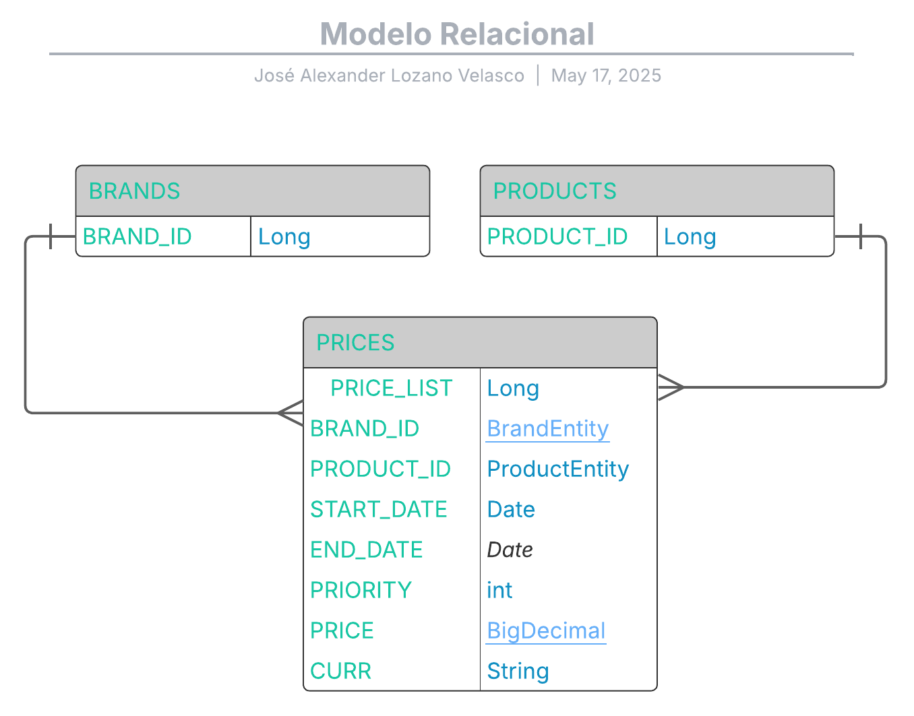

# 📦 Technical-test-bnc
Este servicio de precios esta diseñado para gestionar de manera eficiente y escalable la información de precios en una plataforma de comercio electrónico. Su principal función es proporcionar los precios aplicables a productos específicos en función de la fecha de aplicación, el identificador del producto y el identificador de la marca.

Este servicio adopta la arquitectura hexagonal (también conocida como puertos y adaptadores). Este patrón arquitectónico propone una separación clara entre la lógica de negocio y las dependencias externas, como bases de datos, interfaces de usuario o servicios externos. La lógica de negocio se encuentra en el núcleo de la aplicación, mientras que las interacciones con el mundo exterior se manejan a través de puertos (interfaces) y adaptadores que implementan estas interfaces . 


## 🛠️ Tecnologías Utilizadas

| Tecnología          			 | Descripción                                                   |
|--------------------------------|---------------------------------------------------------------|
| **Java 17**         			 | Lenguaje de programación principal                            |
| **Spring Boot**     			 | Framework para desarrollo rápido de aplicaciones Java         |
| **Base de datos H2**           | Base de datos en memoria utilizada para pruebas y desarrollo  |
| **Jacoco**                     | Herramienta para generar informes de cobertura de código      |
| **Junit 5**                    | Permite escribir y ejecutar pruebas unitarias y de integración|
| **Spring Data JPA** 			 | Abstracción para el acceso a datos con repositorios           |
| **OpenAPI** 		  			 | Documentación interactiva de la API REST 				     |
| **Maven**           			 | Gestión del ciclo de vida del proyecto Java                   |


## 💡 Buenas prácticas y patrones aplicados

- ✅ Uso de **DTO (Data Transfer Object)** para desacoplar entidades del modelo de datos
- ✅ Implementación de **JPQL (Java Persistence Query Language)** para consultas personalizadas
- ✅ Arquitectura Hexagonal
- ✅ Manejo de errores y trazabilidad con **logs estructurados (SLF4J + LogHelper)**
- ✅ Uso de excepciones personalizadas y manejo centralizado de errores
- ✅ Test con Junit

---


## 📘 Arquitectura del Proyecto - Arquitectura Hexagonal

## **📌 Estructura del Proyecto **

```
📦 com.ecommerce
├── 📁 domain
│   ├── 📁 model              ← Entidades y Value Objects
│   └── 📁 service            ← Servicios de dominio
│
├── 📁 application
│   ├── 📁 dto                ← DTOs usados en los casos de uso
│   ├── 📁 mapper             ← Mappers entre DTO y modelo
│   ├── 📁 port
│   │   └── 📁 in             ← Interfaces de casos de uso
│   └── 📁 service            ← Implementaciones de los casos de uso
│
├── 📁 adapter
│   ├── 📁 in
│   │   └── 📁 rest
│   │       ├── 📁 controller ← Controladores REST
│   │       ├── 📁 dto        ← Request y response para REST
│   │       ├── 📁 advice     ← Manejo de errores/excepciones
│   │
│   └── 📁 out
│       └── 📁 persistence
│           ├── 📁 entity     ← Entidades JPA (si aplican)
│           ├── 📁 mapper     ← Mappers JPA ↔ Dominio
│           └── 📁 repository ← Repositorios técnicos
│
└── 📁 config                 ← Configuración general (Beans, Security, Swagger, etc.)
└── 📁 utils
             


```
---

## **📝 Logging**
Se utiliza **SLF4J** junto con un helper personalizado (**LogHelper**) para estructurar los logs.
Cada acción del sistema (inicio, éxito, error, fin) es registrada, facilitando la trazabilidad y el análisis de errores.

---

## 🚀 Pasos para ejecutar el proyecto

 **Paso 1: Clonar el repositorio:**

```bash
git clone https://github.com/AlexanderLozano17/technical-test-bnc.git
```

 **Paso 2. Construir el proyecto:**
 
```bash
mvn clean install
```

 **Paso 3. Ejecutar la aplicación**
 
```bash
mvn spring-boot:run
```
 **Paso 4. La aplicación estará disponible en:**

```bash
http://localhost:8080.
```

## Modelo relacional



## Documentaciòn del Modelo relacional
🗃️ **Tabla: PRODUCTS**

| Campo        | Tipo     | Clave | Descripción                        |
|--------------|----------|-------|------------------------------------|
| `PRODUCT_ID` | INT      | PK    | Identificador único del producto   |
| `NAME`       | VARCHAR  |       | Nombre del producto                |

---

🗃️ **Tabla: BRANDS**

| Campo      | Tipo     | Clave | Descripción                       |
|------------|----------|-------|-----------------------------------|
| `BRAND_ID` | INT      | PK    | Identificador único de la marca   |
| `NAME`     | VARCHAR  |       | Nombre de la marca                |

---

🗃️ **Tabla: PRICES**

| Campo         | Tipo      | Clave | Descripción                                                              |
|---------------|-----------|-------|--------------------------------------------------------------------------|
| `PRICE_LIST`  | INT       | PK    | Identificador único del precio                                          |
| `BRAND_ID`    | INT       | FK    | Referencia a `BRANDS(BRAND_ID)`                                         |
| `PRODUCT_ID`  | INT       | FK    | Referencia a `PRODUCTS(PRODUCT_ID)`                                     |
| `START_DATE`  | DATETIME  |       | Fecha de inicio de la vigencia del precio                               |
| `END_DATE`    | DATETIME  |       | Fecha de fin de la vigencia del precio                                  |
| `PRIORITY`    | INT       |       | Prioridad del precio (para resolver conflictos de vigencia)             |
| `PRICE`       | DECIMAL   |       | Valor del precio                                                         |
| `CURR`        | VARCHAR   |       | Moneda del precio (por ejemplo: `USD`, `EUR`)                           |


## Endpoints
**Ejemplo de peticiónes 1.**

```bash
curl -X GET "http://localhost:8080/api/price"
```

```json
[
    {
        "priceList": 1,
        "productId": 35455,
        "brandId": 1,
        "startDate": "2020-06-14T00:00:00",
        "endDate": "2020-12-31T23:59:59",
        "price": 35.50
    },
    {
        "priceList": 2,
        "productId": 35455,
        "brandId": 1,
        "startDate": "2020-06-14T15:00:00",
        "endDate": "2020-06-14T18:30:00",
        "price": 25.45
    },
    {
        "priceList": 3,
        "productId": 35455,
        "brandId": 1,
        "startDate": "2020-06-15T00:00:00",
        "endDate": "2020-06-15T11:00:00",
        "price": 30.50
    },
    {
        "priceList": 4,
        "productId": 35455,
        "brandId": 1,
        "startDate": "2020-06-15T16:00:00",
        "endDate": "2020-12-31T23:59:59",
        "price": 38.95
    }
]
```

**Ejemplo de peticiónes 2.**

```bash
curl -X GET "http://localhost:8080/api/price/2020-06-14T16:00:00/35455/1"
```

```json
{
  "priceList": 2,
  "productId": 35455,
  "brandId": 1,
  "startDate": "2020-06-14T15:00:00",
  "endDate": "2020-06-14T18:30:00",
  "price": 25.45
}
```

**Ejecutar los Test:**  

```bash
mvn clean test
```
**Para la covertura se utilizo la herramineta JaCoCo y se puede visualizar en la siguiente ruta:**:

```bash
target/site/jacoco/index.html
```

**Documentación OpenAPI (Swagger):**  
   
```bash
👉 http://localhost:8080/swagger-ui/index.html
```